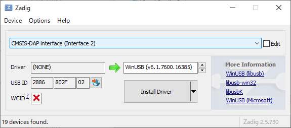

# Debug Tools Builder

OpenOCDなどのマイコンデバッグ向けツールのバイナリをビルドするためのスクリプト (主にDockerfile) と、Windows/Linux向けビルド済みバイナリを提供する。

## 内容

### [buildenv](buildenv)

各ツールをビルドするために必要なものを入れたDockerイメージ

### [daplink](daplink)

buildenvを使って Seeeduino XIAO用のDAPLinkファームウェアをビルドするためのDockerイメージ

### [openocd](openocd)

buildenvを使って OpenOCDやpicotooolのLinux版/Windows版をビルドするためのDockerイメージ

## ビルド済みバイナリ

最新版は [リリースページから](https://github.com/ciniml/debug-tools-builder/releases/tag/v1.1) ダウンロードできる。

### 内容物

* picoprobe + CMSIS-DAP v2対応のOpenOCD
  *  OpenOCDの現時点でのmasterのHEAD (ba0f382137749b78b27ac58238735cc20a6fa847) に Raspberry Piの管理するOpenOCDのpicoprobeブランチのHEAD (eb22aceb524ee0460d4de48e6b3c867502be937f) をマージして調整したもの
  *  コードは[こちら](https://github.com/ciniml/openocd/tree/picoprobe)
* Seeed Studioが管理する[Seeed_Arduino_DAPLink](https://github.com/Seeed-Studio/Seeed_Arduino_DAPLink)の[`custom_pins.ino`](https://github.com/Seeed-Studio/Seeed_Arduino_DAPLink/tree/master/examples/custom_pins) サンプルをビルドしたバイナリ
  * これを作ったのは筆者なので、サンプルとしては筆者が製作中のWio Terminal用デバッグアダプタボード用のピン配置になっている。ぼちぼち回路図アップします。
* [picotool](https://github.com/raspberrypi/picotool)
  
### Linuxでの使い方

XXX-linux.tar.gz を適当な場所に展開するだけ。 対象のUSBデバイスによってはudevなどの設定をしないと動作時に管理者権限が必要となるので、そのあたりは適宜設定すること。

### Windowsでの使い方

HIDのデバイスは特に設定することなく使える。

ビルド済みのDAPLinkファームウェアを使った場合は [Zadig](https://zadig.akeo.ie/) を使ってドライバを入れる必要がある。

CMSIS-DAP v2の場合は以下のとおりWinUSBドライバをインストールする。

Raspberry Pi Picoのブートローダーの場合は以下のとおりWinUSBドライバをインストールする。

